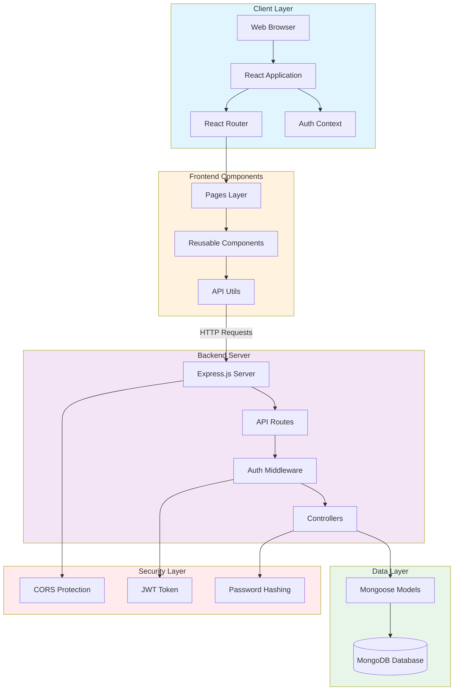
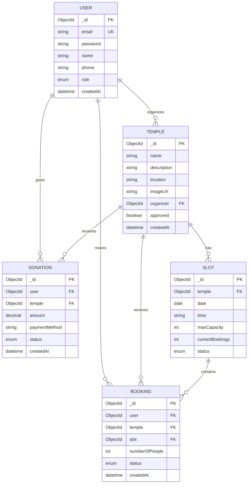

# DARSHANEASE - Project Documentation

## Overview

DARSHANEASE is a web application for temple visit booking and management. The system allows users to browse temples, book time slots for darshan (temple visits), and make donations. Temple organizers can manage their temples and time slots through an admin dashboard.

## Project Structure

```
DARSHANEASE/
├── backend/           # Node.js Express server
│   ├── src/
│   │   ├── config/    # Database configuration
│   │   ├── controllers/ # Business logic
│   │   ├── middleware/  # Authentication middleware
│   │   ├── models/      # MongoDB schemas
│   │   └── routes/      # API endpoints
│   └── scripts/       # Database seed scripts
├── frontend/          # React application
│   └── src/
│       ├── components/ # Reusable UI components
│       ├── context/    # React context for state
│       ├── pages/      # Page components
│       └── utils/      # Helper functions
```

## Technology Stack

### Backend
- Node.js with Express.js
- MongoDB with Mongoose ODM
- JWT for authentication
- bcryptjs for password hashing
- CORS enabled

### Frontend
- React 19
- React Router for navigation
- Axios for API calls
- Framer Motion for animations
- Lucide React for icons
- Vite as build tool

## System Architecture



The application follows a three-tier architecture with clear separation between the client layer, backend server, and data layer. Authentication and security measures are implemented across all layers.

## Features

### User Features
- User registration and login
- Browse available temples
- View temple details and darshan hours
- Book time slots for temple visits
- View booking history
- Make donations to temples
- Cancel bookings

### Organizer Features
- Add new temples (pending admin approval)
- Manage temple information
- Create and manage time slots
- View bookings for their temples
- Dashboard with statistics

### Admin Features
- Approve or reject temple submissions
- Assign organizer roles to users
- Full system oversight

## Database Models

### Entity Relationship Diagram



### User
- Email, password (hashed)
- Name and phone number
- Role: user, organizer, or admin
- Timestamps

### Temple
- Name, description, location
- Image URL and map link
- Darshan hours (start and end time)
- Organizer reference
- Approval status
- Creation timestamp

### Slot
- Temple reference
- Date and time
- Duration in minutes
- Maximum capacity
- Current bookings count
- Status: available, booked, or cancelled

### Booking
- User and temple references
- Slot reference
- Number of people
- Booking date
- Status: confirmed, cancelled, or completed
- Timestamps

### Donation
- User and temple references
- Amount
- Payment method
- Transaction reference
- Status: pending, completed, or failed
- Timestamps

## API Endpoints

### Authentication
- POST /api/auth/register - Register new user
- POST /api/auth/login - User login
- GET /api/auth/me - Get current user

### Temples
- GET /api/temples - List all approved temples
- GET /api/temples/:id - Get temple details
- POST /api/temples - Create new temple (organizer)
- PUT /api/temples/:id - Update temple (organizer)
- DELETE /api/temples/:id - Delete temple (organizer)

### Slots
- GET /api/slots/temple/:templeId - Get slots for a temple
- POST /api/slots - Create new slot (organizer)
- PUT /api/slots/:id - Update slot (organizer)
- DELETE /api/slots/:id - Delete slot (organizer)

### Bookings
- GET /api/bookings/my-bookings - Get user bookings
- GET /api/bookings/temple/:templeId - Get temple bookings (organizer)
- POST /api/bookings - Create booking
- PUT /api/bookings/:id/cancel - Cancel booking

### Donations
- GET /api/donations/my-donations - Get user donations
- GET /api/donations/temple/:templeId - Get temple donations (organizer)
- POST /api/donations - Make donation

## Setup Instructions

### Prerequisites
- Node.js (version 14 or higher)
- MongoDB database
- npm or yarn package manager

### Backend Setup

1. Navigate to backend directory:
```bash
cd backend
```

2. Install dependencies:
```bash
npm install
```

3. Create .env file with the following variables:
```
PORT=5000
MONGODB_URI=your_mongodb_connection_string
JWT_SECRET=your_jwt_secret_key
```

4. Run database seed scripts (optional):
```bash
node scripts/seed.js
node scripts/seedUsers.js
```

5. Start the server:
```bash
npm start
```

The backend will run on http://localhost:5000

### Frontend Setup

1. Navigate to frontend directory:
```bash
cd frontend
```

2. Install dependencies:
```bash
npm install
```

3. Create .env file with:
```
VITE_API_URL=http://localhost:5000/api
```

4. Start development server:
```bash
npm run dev
```

The frontend will run on http://localhost:5173

## User Roles and Permissions

### Regular User
- Browse temples
- Book slots
- Make donations
- View own bookings and donations

### Organizer
- All user permissions
- Add new temples
- Manage own temples
- Create and manage slots
- View bookings for own temples

### Admin
- All organizer permissions
- Approve temples
- Assign organizer roles
- System-wide access

## Development Scripts

### Backend
- Seed temples: `node scripts/seed.js`
- Seed users: `node scripts/seedUsers.js`
- Assign organizer role: `node scripts/assignOrganizers.js`

### Frontend
- Development mode: `npm run dev`
- Build for production: `npm run build`
- Preview production build: `npm run preview`

## Security Features

- Password hashing with bcryptjs
- JWT token-based authentication
- Protected routes requiring authentication
- Role-based access control
- Input validation on API endpoints

## Future Enhancements

- Payment gateway integration for donations
- Email notifications for bookings
- SMS reminders for upcoming visits
- Rating and review system
- Multi-language support
- Mobile application
- QR code for booking verification


## Support

For issues or questions, please refer to the project repository or contact the development team.
